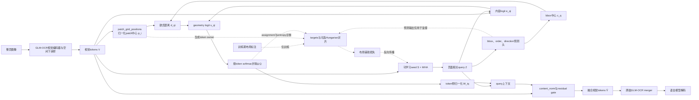

# 设计说明

## 1. 核心瓶颈与设计边界

整页符号识别既需要保留局部形态，又需要建模区域、阅读顺序和书写方向。小样本适配时，若仅依赖文本生成损失，稀疏布局信号容易被高频内容信号覆盖；若把标注布局作为推理输入，则破坏整页端到端协议。

## 2. 总体架构

GLM-OCR 的视觉编码器先生成整页 visual tokens。`PreMergeLayoutAdapter` 使用可学习 seed queries 对这些 tokens 做交叉 attention，得到布局 queries；随后预测区域、顺序和方向，并在视觉内容进入原合并器前回写布局上下文。布局真值不出现在 `forward` 接口中。

当前代码还实现了一个可选的 validity/no-object 分支：Hungarian 对齐后，将匹配到标注区域的 query 标为 valid，未匹配 query 标为 no-object；`validity_head` 从页面相关 query 预测 `p_valid`，再对 query→视觉 transport 和 token 侧融合做门控。该分支目前是待验证架构候选，不是已经确认的默认结构。全量 MTHv2 的 256-step 诊断中，`p_valid` 从约 0.05 整体升至约 0.60，但 valid/no-object 的分离不足，gated invalid fusion mass 仍约 0.95，因此不能把 validity gating 表述为已验证收益。

## 3. 模块与对照

当前确认实验优先比较 `attention` 与 `geometry`，并保留 `layout_ot` 作为运输约束对照。`geometry` 在内容相似度中加入预测区域中心—patch 中心距离；`layout_ot` 使用同一几何 score，但进一步调用半松弛传输。该实现仍是项目候选设计，不是已验证结论。

四种模式共用 query 生成器、bbox/order/direction 预测头、残差写回和原始 merger：`content_only` 不回写布局，`attention` 只使用内容 score，`geometry` 使用中心距离偏置后的 softmax，`layout_ot` 使用相同 score 的半松弛运输。这样可分离 query 参数、几何偏置和运输约束的贡献。

## 4. Geometry 融合：论文级定义

本节给出当前代码的逐步定义。几何融合不是独立的页面检测器，也不是把标注框作为额外输入；它是发生在 GLM-OCR 原始视觉 merger 之前、对同一组视觉 token 的可微残差条件化。

### 4.1 接入位置和符号

设 batch 大小为 B，视觉 token 数为 N，隐藏维度为 D，布局 query 数为 Q。当前机制筛选使用单页输入，bridge 实际约束 B=1，但适配器张量保留 batch 维度。视觉编码器下采样并进入原始 merger 前的 token 记为 V ∈ R^(B×N×D)；可学习 query seed 记为 S ∈ R^(Q×D)。

LayoutAwarePatchMerger 的调用顺序是：整页图像 → GLM-OCR visual encoder 和空间下采样 → hidden_state [N,D] → PreMergeLayoutAdapter → adapted hidden_state [N,D] → 原始 GLM-OCR merger。bridge 将 hidden_state 增加 batch 维并转为 float 后送入适配器；adapter_precision=fp32 时显式关闭 autocast，写回前再转回原 hidden_state dtype。融合不改变 N、D 或 token 顺序。

下图中的实线表示推理与训练共用的 forward 路径，虚线表示只在训练或诊断阶段使用的标注、匹配和辅助损失路径。布局标注不会沿实线进入 geometry score。

### 4.2 视觉 patch 的归一化位置

patch_positions 由 image_grid_thw 和 spatial_merge_size 在模型内部重建，不读取 bbox 标注。设视觉网格高度和宽度为 H、W，空间下采样倍率为 s，代码使用 H′ = H // s、W′ = W // s，并要求 N = H′W′。第 r 行、第 c 列 token 的归一化中心为：

$$p_(rW′+c) = ((c + 0.5) / W′, (r + 0.5) / H′), 0 ≤ r < H′, 0 ≤ c < W′.$$

位置按照 torch.meshgrid(indexing="ij") 后的行优先顺序展平，与视觉 token 序列保持一致。p_i 只表示视觉网格中的相对坐标，不是原始像素坐标，也不是布局 ground truth。当前 whole-page bridge 还要求 temporal = 1，不接受视频或多帧输入。

### 4.3 页面相关 query

seed S 在 batch 维复制后，以视觉 token 为 key 和 value 做一次多头交叉注意力：

$$Z = LN_q(S + MHA(S, V, V)), Z ∈ R^(B×Q×D).$$

Z 是当前页面相关的布局 query。S 跨页面共享，Z 随页面视觉内容变化；forward 不接收 GT bbox、reading order 或 writing direction。

### 4.4 由 query 预测 bbox 中心

每个 query 经过 bbox、order 和 direction 三个预测头。geometry score 只使用 bbox head；order 和 direction 只通过共享 query 和辅助损失间接影响融合：

$$u_q = W_b z_q + b_b, r_q = sigmoid(u_q).$$

sigmoid 使四个坐标落在 [0,1]。代码随后显式重排两个角点：

$$b_q = (min(r_q0,r_q2), min(r_q1,r_q3), max(r_q0,r_q2), max(r_q1,r_q3)).$$

框中心为：

$$c_q = ((b_q0 + b_q2) / 2, (b_q1 + b_q3) / 2).$$

当前实现因此是中心距离几何，而不是完整 bbox 几何：框的宽高、面积、边界距离和 IoU 不直接进入 score，只由 bbox 辅助损失监督。数据记录中的 regions[*].bbox 必须已经是归一化 xyxy；layout_targets() 不会把像素坐标再次归一化。

### 4.5 内容 logit 加入几何偏置

先计算与 attention 对照完全相同的内容相似度：

$$e_qi = z_q^T v_i / sqrt(D).$$

然后计算预测中心与 patch 中心的二维欧氏距离：

$$d_qi = ||c_q - p_i||_2.$$

geometry 的最终融合 logit 为：

$$s_qi = e_qi - d_qi / τ_g.$$

τ_g 是 geometry_temperature，当前默认值为 0.2。距离越近，惩罚越小；距离越远的 patch 仍然可以被读取，但必须有足够高的内容相似度抵消几何惩罚。因此，这是 soft spatial prior，不是硬区域 mask。τ_g 越小，空间先验越尖锐；τ_g 越大，geometry 越接近普通 attention。

实现用 torch.cdist 计算中心到 patch 的距离，并先在 float32 中计算距离，再转换回 score dtype。因为 c_q 来自当前 forward 的预测框，OCR loss 和 assignment loss 可以通过 s_qi → d_qi → c_q → b_q → z_q 回传到 bbox head 和 query 生成器；几何项不是静态位置编码或训练后后处理。

### 4.6 从 score 得到 query–token 权重

geometry 不调用 SemiRelaxedTransport。它沿 token 维做普通 softmax，再固定每个 query 的总质量：

$$A_qi = softmax_i(s_qi), T_qi = A_qi / Q.$$

因此每个 query 满足 sum_i T_qi = 1 / Q。这个除法只控制不同 query 数下的整体写回幅度，不构成最优传输的双边缘约束；geometry 中的 transport 变量应称为归一化 attention 权重，而不是 OT plan。

随后把 T 转成 token-first，并在每个 token 的 query 维重新归一化：

$$W_iq = T_qi / (sum_k T_ki + 1e-12).$$

于是每个视觉 token 得到多个 query 的凸组合：

$$h_i = LN_c(sum_q W_iq z_q).$$

其中 LN_c 对应 content_norm。当前实现没有额外 MLP、concat、第二个 cross-attention block 或 token 数量变化。基础 `attention`/`geometry`/`layout_ot` 路径中，由于 softmax 权重严格为正，所有 query 默认都能参与融合；`query_mask` 只用于辅助损失和诊断，不会自动屏蔽未匹配 query。

启用 validity/no-object head 时，先由 query 预测：

$$p_q = sigmoid(l_q^{valid}), \quad T^{gate}_{qi} = T_{qi} p_q.$$

然后按视觉 token 重新归一化 gated transport，并计算有效覆盖率：

$$W^{gate}_{iq} = T^{gate}_{qi} / (sum_k T^{gate}_{ki} + 1e-12), \quad c_i = sum_q T^{gate}_{qi} / (sum_q T_{qi} + 1e-12).$$

融合上下文为 `c_i × LN_c(sum_q W^{gate}_{iq} z_q)`。这一步避免单纯重新归一化抵消 `p_valid` 的门控效果：即便 gated transport 在 token 侧重新归一化，validity 较低仍会通过 `c_i` 减小布局上下文写回。raw transport、gated transport 和 valid coverage 均保留用于诊断。

### 4.7 受控残差写回

布局上下文以一个全局可学习标量写回原视觉 token：

$$ṽ_i = v_i + α h_i, α = clip(tanh(g), -α_max, α_max).$$

content_gate g 初始化为 0。旧 checkpoint 未设置上限时使用 α = tanh(g)；稳定性确认配置设置 α_max = 0.03，把有效残差限制在 [-0.03, 0.03]。门控是一个标量，不为不同 query、token 或通道分别学习写回强度。

零初始化产生两个工程性质：第一，初始 forward 满足 ṽ_i = v_i，是严格 identity path；第二，在 α = 0 的瞬间，OCR 主损失对 h_i 内容参数的直接梯度被门控，但对 g 仍有梯度，布局辅助损失可以同时训练 query 和 bbox 预测。之后门控逐渐打开，geometry context 才会改变视觉表示。

最后，bridge 将 ṽ 转回原 hidden_state dtype，并调用原始 base_merger。因此 geometry 是“原 merger 前的残差条件化”，不是先裁剪页面再调用另一个 OCR 模型。

### 4.8 训练目标与标签隔离

训练总目标写为：

$$L = L_OCR + λ_aux(λ_b L_box + λ_o L_order + λ_d L_direction + λ_a L_assignment + λ_e L_entropy + λ_v L_validity).$$

当前 `full` 配置的权重为 (λ_b, λ_o, λ_d, λ_a, λ_e, λ_v) = (1, 0.5, 0.5, 1, 0, 0)；`no_assignment_validity` 配置为 (1, 0.5, 0.5, 0, 0, 0.5)。稳定性确认使用 λ_aux = 0.2，MTHv2 validity 诊断使用辅助权重从 0.05 线性 ramp 到 0.2。这些是当前实验协议，不是 geometry score 的必要组成部分。

- L_box：对归一化 xyxy bbox 使用 Smooth L1，并按有效 query mask 平均。
- L_order：对 order_scores 使用 Smooth L1，reading order 归一化到 [0,1]。
- L_direction：对 vertical_rtl、horizontal_ltr、unknown 使用交叉熵。
- L_assignment：把 T 转成 token-first 后，对有 owner 的 patch 使用 NLL；owner = -1 的 patch 忽略。
- L_entropy：记录 transport 熵，默认权重为 0；geometry 中它作用于 softmax 权重，layout_ot 中才与半松弛 OT 一起解释。
- L_validity：对 Hungarian 后的 `query_mask` 使用按页面正负类分别归一化的 balanced BCE，使 valid 与 no-object query 在页面内获得相近的类别权重。它只在启用 validity head 时非零。

数据层按 reading_order 排序 regions，并根据 patch center 是否落在 bbox 内生成 token_owners。重叠框当前取排序后的第一个 region，框外 patch 标记为 -1。所有这些 target 都是在 adapter forward 完成后生成，不改变 patch_positions 和 geometry score。

若使用 hungarian query assignment，代码只用 detached 的预测框和 sigmoid 后的 order score 对 query slot 进行匹配，代价为：

$$C_mq = 0.7 mean(|b_m - b̂_q|) + 0.3 |o_m - sigmoid(ô_q)|.$$

匹配结果只重排辅助监督目标，不把 GT 框、GT 顺序或匹配索引回填到 forward。因此 hungarian 不构成 label leakage，推理仍然是整页、无布局标注的路径。

### 4.9 与其它融合模式的精确差异

四种模式共用 query 生成器、预测头、残差写回和原始 merger，差异只在 score 或权重：

| 模式 | score | 权重/融合 |
|---|---|---|
| content_only | 不计算布局 score | 直接返回 V |
| attention | e_qi | T = softmax_i(e_qi) / Q |
| geometry | e_qi − d_qi / τ_g | T = softmax_i(s_qi) / Q |
| layout_ot | e_qi − d_qi / τ_g | SemiRelaxedTransport(s) |
| geometry + validity | e_qi − d_qi / τ_g | 对 T 施加 p_valid 门控，并以 valid coverage 保留幅度信息 |

所以 geometry 相对于 attention 的新增量是预测中心距离偏置及其反向梯度；相对于 layout_ot，geometry 不含固定 query 边缘和松弛 token 边缘的迭代更新。比较时必须固定 query 数、训练预算、数据划分、残差约束、精度和 loss profile。

### 4.10 计算开销、可归因性和限制

相对于 attention，geometry 主要增加 B×Q×N 的距离矩阵，计算和显存量级约为 O(BQN)。它不增加 geometry 专用的可学习参数；bbox head 在布局模式中共同存在，以保持参数量对等。额外的几何计算通常低于 backbone 和 query–token 相似度计算，但在 N 或 Q 较大时仍需记录实际峰值显存。

论文中应明确以下限制：当前几何项只使用预测 bbox 中心；T 是两次局部归一化后的 softmax 权重而非严格 OT；基础路径中的未匹配 query 不会在 forward 中自动消失；validity 分支虽能对 transport 做门控，但当前 MTHv2 诊断尚未形成 valid/no-object 分离，不能视为已解决无效 query 问题；训练早期错误 bbox 或 validity 概率可能造成错误空间排斥；τ_g、残差上限、validity 权重和辅助损失权重必须由 validation-only 协议确定。geometry 是否稳定优于 attention，以及 validity gating 是否能降低重复生成，仍需统一多 seed、小样本划分和跨来源验证，不能由单个短程 run 推断。

### 4.10.1 Validity 分支的当前证据边界

全量 MTHv2 `glmocr_mthv2_validity_no_assignment_256_v1` 使用 512 queries、五卡同步 DDP、有效 global batch 20、峰值学习率 `2.5e-5`、gate 全程冻结和 `no_assignment_validity` profile。训练指标已记录到 step 256：前 64 步与后 64 步的 OCR loss 中位数约为 `1.3856` 与 `1.4068`，没有形成下降趋势；valid/no-object 的 `p_valid` 差值后程均值约 `0.0101`，step 256 约 `0.0177`，gated invalid fusion mass 仍约 `0.946`。因此该分支目前只能证明实现可运行并且数值有限，不能证明它改善了 OCR 或 query 选择。

### 4.11 与代码的对应关系

- glm_bridge.py::patch_grid_positions：从 image_grid_thw 和 spatial_merge_size 生成归一化 patch 中心，并保持视觉 token 的行优先顺序。
- glm_bridge.py::LayoutAwarePatchMerger.forward：在原始 merger 前建立 batch 维、调用适配器、记录诊断量，并把融合结果转回 backbone dtype。
- adapter.py::PreMergeLayoutAdapter._queries：执行 seed query 到视觉 token 的多头交叉注意力。
- adapter.py::PreMergeLayoutAdapter._scores：计算 e_qi；在 geometry/layout_ot 模式下计算 cdist 并减去 d_qi / τ_g。
- adapter.py::PreMergeLayoutAdapter.forward：预测 bbox/order/direction，执行 geometry softmax 或 layout_ot transport，完成 token 侧归一化、content_norm 和残差写回。
- data.py::layout_targets：根据标注 bbox、reading_order 和 patch center 生成辅助监督 target；该函数在 forward 之后调用。
- losses.py::match_layout_targets 与 compute_layout_losses：执行可选 Hungarian target-slot 对齐和布局辅助损失，不改变 geometry forward。

## 5. 目标函数

目标函数的逐项定义、默认权重和 target-query 对齐边界见第 4.8 节。本模块新增 bbox Smooth L1、顺序回归、方向分类和 token-region assignment NLL；无标注 query 通过 mask 忽略，传输熵默认权重为零。

## 6. 训练策略

确定性 A100 架构对照已经支持 geometry 在 `step 768` 取得当前 validation 最优组合，但这只证明固定小样本协议下的候选可运行性。进入全量 MTHv2 后，`glmocr_mthv2_full_ddp_v1` 因学习率调度过早降至 `5e-6` 停止，gate warm-start 诊断也没有形成可用于正式训练的证据；随后 `no_assignment` 与 validity/no-object 诊断显示，辅助项可以下降，但 OCR loss 仍在约 1.4 附近振荡。因此当前训练策略的重点已从“继续放大训练规模”转为先确认 query target、validity 梯度和 gated fusion 路径。

稳定性确认保持主干、原 patch merger、输入协议和 `auxiliary_weight=0.2` 不变，只训练 pre-merger adapter。学习率先用 64 steps 线性 warmup 至 `5e-5`，再 cosine 衰减，并在 step 1024 到达 `5e-6`。原始 `content_gate` 仍作为 checkpoint 参数保存，实际回写系数采用 `clamp(tanh(content_gate), -0.03, 0.03)`；未配置上限的旧 checkpoint 继续使用原始 `tanh` 语义。受控小残差尺度的设计依据来自 ReZero 的零初始化残差思想和 CaiT LayerScale 的小尺度残差注入，但 `0.03` 是依据本项目首轮最佳 checkpoint 的观察值设定，属于项目修改而非两篇论文的原始超参数[4-5]。

全量 MTHv2 的正式协议仍为 train 2159 页、validation 240 页、test 800 页；正式 selection 和 test 尚未因上述诊断而启动。当前 validity 诊断只使用 seed42，训练阶段不读取 test、不生成 selection；后续是否扩展到 seed43/44，必须先由 validation-only 结果和 query-level 机制证据决定。

## 7. 轻量化边界

首轮仅训练 adapter、query seeds 和辅助头，以减少小样本过拟合与存储开销。这是训练范围控制，不单独作为结构创新。后续是否解冻视觉高层或合并器，由统一消融结果决定。

## 8. 接入与风险

接入点是 GLM-OCR 视觉 tokens 进入视觉—语言合并器之前；当前代码按锁定的 GLM-OCR checkpoint 建立并验证了这一 pre-merger tensor seam，正式实验仍需固定同一 checkpoint、processor 和整页输入协议。主要失败风险是 query collapse、Hungarian target 与 query 表征不一致、validity head 学成全局偏置、gated fusion 被 token 侧归一化抵消、OT 数值敏感、辅助监督压制识别目标，以及不同对照计算量不对等。

## 9. 方法来源边界

直接采用部分：GLM-OCR 官方 checkpoint `ca5d8b3e287e52589e37c28385d9655ee4372f9d`、CogViT 视觉编码器、空间下采样、`GlmOcrVisionPatchMerger` 和 GLM-0.5B decoder。官方 Transformers 实现明确在视觉 block 后先下采到 1536 维 token，再调用 patch merger[1-3]。

结合项目修改部分：`LayoutAwarePatchMerger` 保留官方 merger，但在其前对下采样 token 执行布局融合。数据使用整页 `Text Recognition:` prompt，不使用官方 SDK 的 PP-DocLayout-V3 裁剪两阶段推理。

项目新增部分：整页布局 queries、预测 bbox 中心的 geometry score、布局条件化半松弛 OT、四种模式对照、布局辅助目标，以及可选的 validity/no-object query 门控。这些是项目候选设计；其中 validity 分支已完成代码与五卡诊断，但尚未获得改善 OCR 或降低无效 fusion 的实验支持，不归因为 GLM-OCR 原论文方法。

## 参考文献

[1] Duan, S., Xue, Y., Wang, W., et al. GLM-OCR Technical Report. arXiv:2603.10910, 2026. https://arxiv.org/abs/2603.10910

[2] zai-org. GLM-OCR model card, revision `ca5d8b3e287e52589e37c28385d9655ee4372f9d`. https://huggingface.co/zai-org/GLM-OCR

[3] Hugging Face. `modeling_glm_ocr.py`, Transformers 5.3 series. https://github.com/huggingface/transformers/blob/v5.3.0/src/transformers/models/glm_ocr/modeling_glm_ocr.py

[4] Bachlechner, T., Majumder, B. P., Mao, H., et al. ReZero is All You Need: Fast Convergence at Large Depth. arXiv:2003.04887, 2020. https://arxiv.org/abs/2003.04887

[5] Touvron, H., Cord, M., Sablayrolles, A., et al. Going Deeper With Image Transformers. ICCV, 2021. https://openaccess.thecvf.com/content/ICCV2021/html/Touvron_Going_Deeper_With_Image_Transformers_ICCV_2021_paper.html
