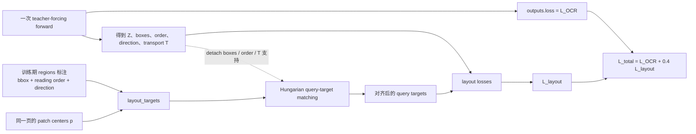

# GLMOCR Geometry 设计（代码对齐、易读版）

> 本文只解释当前正式 mode=geometry 路径。核心代码是 PreMergeLayoutAdapter 和 LayoutAwarePatchMerger；图中的每条主路径都对应实际调用，训练标注只走虚线监督分支。

## 先给结论

你对 geometry 的理解基本正确：它是在第二次 query–token 相关性计算得到的分数上，减去“预测区域中心到 patch 中心的距离惩罚”，然后再做 softmax。

需要补充一个严格的术语区别：代码中只有第一次交互是 nn.MultiheadAttention。第二次不是另一个标准的 nn.MultiheadAttention block，而是手工完成的两步：

1. 用 layout queries 和视觉 tokens 计算相关性矩阵；
2. 将矩阵转置并重新归一化，用 layout queries 加权生成每个视觉 token 的布局上下文。

所以文档中把第二步称为“geometry-aware query-to-token fusion”更准确；如果简称为“第二次 cross-attention”，必须同时注明它不是标准 MHA，并写清楚分数阶段与聚合阶段的 Q/K/V。

## 1. 一张图看懂主前向

实线是训练和推理共用的前向路径。V 是同一个 merger 前视觉 token 张量：它既作为第一次交叉注意力的 K/Value，也作为第二次相关性计算的视觉侧输入，最后还直接走残差主干。

```mermaid
flowchart LR
    IMG[整页图像] --> PROC[Processor]
    PROC --> PIX[图像张量]
    PROC --> GRID[image_grid_thw]
    PIX --> ENC[冻结 GLM-OCR 视觉编码器]
    ENC --> V[merger 前视觉 tokens V]

    GRID --> POS[patch_grid_positions]
    SIZE[视觉配置 spatial_merge_size] --> POS
    POS --> P[确定性的 patch centers p]

    SEED[可学习 seed queries S] --> CA1[Cross Attention 1<br/>Q = S<br/>K = V<br/>Value = V]
    V --> CA1
    CA1 --> Z[页面相关 layout queries Z]

    Z --> HEAD[box / order / direction heads]
    HEAD --> C[预测 bbox 中心 c]

    Z --> AFF[交互 2：手工相关性计算<br/>Q = Z，K = V<br/>E = ZV^T / sqrt(D)]
    V --> AFF
    AFF --> GEO[geometry<br/>A = E - dist(c,p) / tau_g，tau_g = 0.2]
    C --> GEO
    P --> GEO

    GEO --> WT[权重归一化<br/>T = softmax over tokens / Q<br/>W = transpose(T)，再按 query 归一化]
    Z --> WT
    WT --> H[Value = Z<br/>H = WZ]

    V --> ADD[V_tilde = V + alpha H]
    H --> ADD
    ADD --> MERGER[原始 GLM-OCR visual merger]
    MERGER --> DEC[GLM-OCR language decoder<br/>冻结基座 + 可训练 LoRA]
    PROMPT[Text Recognition: prompt] --> DEC
    DEC --> OUT[OCR 文本]
```

图中有三个容易画错的地方：

- patch centers p 不是视觉编码器预测出来的 bbox，也不是 GT。它由 image_grid_thw 和 spatial_merge_size 确定性重建。
- geometry 只把预测 bbox 的中心 c 放进距离项；bbox 的宽高、IoU 和边界没有直接进入 geometry score。
- V_tilde 先经过原始 visual merger，再进入语言解码器；不是把 layout decoder 的输出直接加到 LLM 输入上。

## 2. 两次交互的 Q、K、V 到底是什么

这里把代码拆成三个动作，避免把第二个动作误读为一个普通的 MHA：

| 动作 | 代码对应 | Q | K | Value（值向量） | 输出 |
|---|---|---|---|---|---|
| 第一次：生成页面相关 query | query_attention(seed, visual_tokens, visual_tokens) | seed S | 视觉 tokens V | 视觉 tokens V | Z，每个 query 一个页面相关表示 |
| 第二次 A：计算 query–token 分数 | queries @ visual_tokens.transpose(-1, -2) | layout queries Z | 视觉 tokens V | 此处还没有单独的 Value 输入 | E 或加入 geometry 后的 A，形状为 [B,Q,N] |
| 第二次 B：把 query 信息写回 token | torch.matmul(token_weights, queries) | 输出按视觉 token i 索引 | — | layout queries Z | H，每个视觉 token 一个布局上下文 |

第一次是标准交叉注意力，可以直接写成：

$$Z=\operatorname{LN}_q\left(S+\operatorname{MHA}(Q=S,K=V,\operatorname{Value}=V)\right).$$

第二次要分开写：

- **分数阶段**：Z 是 Q-like，V 是 K-like，先得到 E = ZV^T / sqrt(D)；
- **聚合阶段**：权重转成 token-first 后，Z 充当 Value，得到 H = WZ。

若只看输出方向，第二次“类似于”视觉 token 作 Q、layout query 作 K/V；但这不是代码实际调用的 API，也不是完全等价的标准 MHA，因为代码先对每个 query 在 token 维做 softmax，再除以 Q，随后又在每个 token 的 query 维重新归一化。因此图中应保留“分数：Q=Z、K=V；聚合：Value=Z”这两个标注，而不要给整个第二步强行指定一个单独的 Q/K/V 三元组。

## 3. Geometry 的实际计算

设 batch 大小为 B（当前整页路径通常 B=1），merger 前视觉 token 数为 N，隐藏维度为 D，query 数为 Q=512：

$$V\in\mathbb{R}^{B\times N\times D},\qquad S\in\mathbb{R}^{B\times Q\times D},\qquad Z\in\mathbb{R}^{B\times Q\times D}.$$

### 3.1 patch 中心从哪里来

Processor 提供 image_grid_thw；bridge 再结合视觉配置中的 spatial_merge_size=s 调用 patch_grid_positions()。若视觉网格为 (1,H,W)，则 merger 前网格为：

$$H'=\lfloor H/s\rfloor,\qquad W'=\lfloor W/s\rfloor,\qquad N=H'W'.$$

第 r 行、第 c 列 token 的归一化中心为：

$$p_{rW'+c}=\left(\frac{c+0.5}{W'},\frac{r+0.5}{H'}\right).$$

代码使用 meshgrid(indexing="ij") 后按行优先展平，所以 p_i 与 v_i 一一对应。p_i 只是视觉网格相对坐标，不是像素坐标，不是预测量，也不是 GT bbox 中心。

### 3.2 先从视觉 token 生成 layout queries

第一次交叉注意力由 PreMergeLayoutAdapter._queries() 完成：

$$Z=\operatorname{LN}_q\left(S+\operatorname{MHA}(S,V,V)\right).$$

这里第二、第三个参数都是 visual_tokens，因此它们分别是 K 和 Value。随后三个 head 从同一个 Z 预测：

$$r_q=\sigma(W_bz_q+b_b)\in[0,1]^4,$$

$$b_q=(\min(r_{q0},r_{q2}),\min(r_{q1},r_{q3}),\max(r_{q0},r_{q2}),\max(r_{q1},r_{q3})).$$

预测中心为：

$$c_q=\left(\frac{b_{q0}+b_{q2}}{2},\frac{b_{q1}+b_{q3}}{2}\right).$$

order_head 和 direction_head 也读取 Z，但它们不直接进入 geometry score。

### 3.3 geometry 加在第二次相关性分数上

先计算内容相关性：

$$E_{qi}=\frac{z_q^{\mathsf T}v_i}{\sqrt{D}}.$$

再计算预测中心与 patch 中心的欧氏距离：

$$G_{qi}=\lVert c_q-p_i\rVert_2.$$

mode=geometry 的核心分数是：

$$\boxed{A_{qi}=E_{qi}-\frac{G_{qi}}{\tau_g}},\qquad \tau_g=0.2.$$

也就是说，你说的“在算第二个相关性矩阵时减去几何惩罚”是对的；更精确地说，是在 scores.softmax(dim=-1) 之前，把中心距离惩罚加到内容 logits 上。这个距离项由 torch.cdist 计算，使用预测中心 c_q，不读取 GT。

距离越小，patch 的 logit 被扣得越少；距离越大，logit 被扣得越多，但不是硬裁剪。高内容相似度仍可能抵消部分距离惩罚，所以这是可微的 soft spatial prior。

### 3.4 从分数得到 token 级布局上下文

代码先对每个 query 沿视觉 token 维做 softmax，再除以 query 数：

$$T_{qi}=\frac{1}{Q}\operatorname{softmax}_{i}(A_{qi}).$$

随后转置为 token-first，并在每个 token 的 query 维重新归一化：

$$W_{iq}=\frac{T_{qi}}{\sum_{k=1}^{Q}T_{ki}+\varepsilon},\qquad \varepsilon=10^{-12}.$$

最后用 layout queries 作为 Value 聚合：

$$h_i=\operatorname{LN}_c\left(\sum_{q=1}^{Q}W_{iq}z_q\right),\qquad H=[h_1,\ldots,h_N].$$

当前 geometry 路径中的 transport 变量实际保存的是上述 softmax 权重 T；这里没有调用 SemiRelaxedTransport。只有 layout_ot 模式才会把 score 送入 OT 模块，本文不把那个对照模式画进主图。

### 3.5 通过受控残差写回原视觉 token

布局上下文最后写回同一份视觉 token：

$$\widetilde V=V+\alpha H,$$

$$\alpha=\operatorname{clip}(\tanh(g),-0.03,0.03),\qquad g_0=0.$$

因此初始化时 alpha=0，有 V_tilde=V；适配器初始不会改变基础模型的视觉前向。LayoutAwarePatchMerger 随后把 V_tilde 交给原始 visual.merger，而不是直接交给语言解码器。

## 4. 训练监督放在哪里

训练图单独画出来，避免把 GT 误画成推理输入：



具体含义如下：

1. 模型先完成不含 GT 的正常 forward，得到 Z、预测框、顺序分数、方向 logits 和 T。
2. forward 之后，layout_targets() 根据标注区域和 p 构造训练 target；token_owners 表示哪些视觉 token 落在某个标注区域内。
3. match_layout_targets() 用 detached 的预测框、预测顺序以及可用的 token 支持计算 Hungarian 匹配。匹配只负责把某个 GT 区域分配给某个 query，不把 GT 框写回 geometry score。
4. 匹配完成后再计算布局辅助损失。当前 full profile 为：

$$L_{\mathrm{layout}}=L_{\mathrm{box}}+0.5L_{\mathrm{order}}+0.5L_{\mathrm{direction}}+L_{\mathrm{assignment}}.$$

5. 当前正式 plain 训练目标为：

$$\boxed{L_{\mathrm{total}}=L_{\mathrm{OCR}}+0.4L_{\mathrm{layout}}}.$$

其中 L_OCR 是整页真值文本的 teacher-forcing 交叉熵。当前正式入口没有把 natural-loop、scheduled sampling 或恢复损失加入默认训练目标；generation_mode=loop_recovery 只影响验证/测试解码协议。

## 5. 当前配置与边界

当前 A100/BSCC geometry 启动器（tools/training/run_glmocr_a100_decoder_lora.sh 和 tools/bscc/run_glmocr_mthv2_decoder_lora_4gpu.sbatch）使用的关键配置是：

| 项目 | 当前值 |
|---|---|
| 输入 | 整页图像 + Text Recognition: prompt |
| query 数 | 512 |
| 第一次 attention head 数 | 8 |
| geometry temperature | 0.2 |
| adapter precision | fp32 |
| residual scale | 初始 0，有效范围 [-0.03, 0.03] |
| query-target assignment | Hungarian |
| layout loss profile | full |
| layout loss weight | 0.4 |
| decoder | 冻结基础权重，当前 decoder-LoRA 入口训练 LoRA 参数 |

adapter.py 还保留了 use_validity_head、region_autoregressive 等可选实验代码，配置层也保留 layout_ot 等对照模式；当前正式 geometry 启动器没有打开这些分支，因此它们不放进上面的主图。以后若启动这些选项，需要为对应实验单独补图和单独写清训练/推理边界。

## 6. 代码对应关系

- src/layout_ocr/glm_bridge.py::patch_grid_positions：从 image_grid_thw 和 spatial_merge_size 重建 p。
- src/layout_ocr/glm_bridge.py::LayoutAwarePatchMerger.forward：接收原始 merger 的输入 hidden_state，执行适配后再调用 base_merger。
- src/layout_ocr/adapter.py::PreMergeLayoutAdapter._queries：第一次交叉注意力，Q=S、K=V、Value=V。
- src/layout_ocr/adapter.py::PreMergeLayoutAdapter._scores：计算 E=ZV^T/sqrt(D)，并在 geometry 模式减去 cdist(c,p)/tau_g。
- src/layout_ocr/adapter.py::PreMergeLayoutAdapter.forward：生成 T、token-side W、布局上下文 H 和 V_tilde=V+alpha H。
- src/layout_ocr/data.py::layout_targets：构造训练期 bbox、order、direction 和 token owner target。
- src/layout_ocr/losses.py::match_layout_targets：执行 detached Hungarian 匹配。
- src/layout_ocr/losses.py::compute_layout_losses：计算 full profile 的布局损失。

## 参考文献

[1] Duan, S., Xue, Y., Wang, W., et al. GLM-OCR Technical Report. arXiv:2603.10910, 2026. https://arxiv.org/abs/2603.10910

[2] zai-org. GLM-OCR model card, revision ca5d8b3e287e52589e37c28385d9655ee4372f9d. https://huggingface.co/zai-org/GLM-OCR

[3] Hugging Face. modeling_glm_ocr.py, Transformers 5.3 series. https://github.com/huggingface/transformers/blob/v5.3.0/src/transformers/models/glm_ocr/modeling_glm_ocr.py
