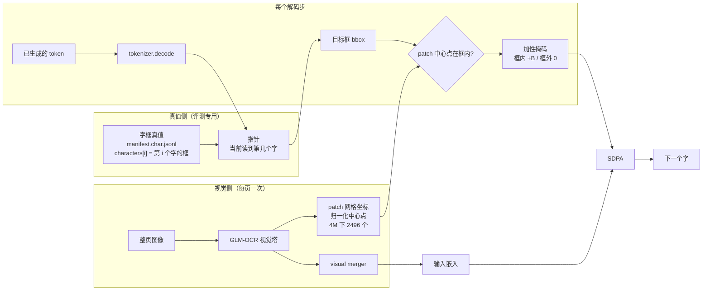
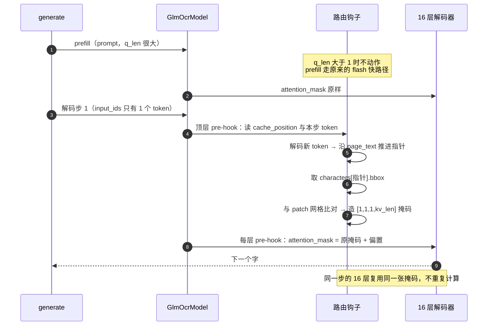
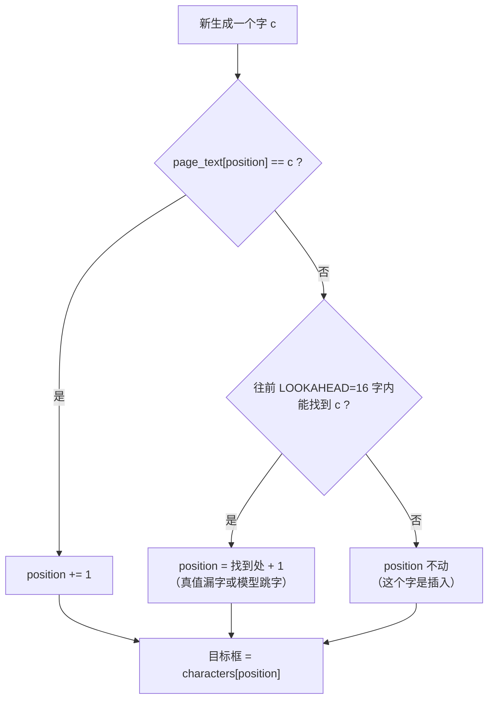

# 布局注意力路由：把偏置打到字框上

**日期**：2026-09-20
**前序**：`plans/LAYOUT_ATTENTION_ROUTING.md`（设计）、`docs/LAYOUT_WRITEBACK_INTERVENTION_RESULT.md`（残差缝的判定）
**状态**：4M 五臂（`noroute`/`bias0`/`bias1`/`bias2`/`bias4`）已全部完成。结论见第五节。

---

## 一、一句话

前面六次（含真值上界）全部是**往序列里加信息**——残差缝的逐 patch 上下文、K 个保留前缀槽。判定是不加最好，逐 patch 分量甚至是敌对的。

这一轮**不动序列**，只改**注意力落在哪里**：在每个解码步，给落在目标字框内的视觉 key 的注意力 logits 加一个常数 $B$。

$$\text{logits}[q,k] \mathrel{+}= B \cdot \mathbb{1}\!\left[\text{patch}(k) \in \text{box}(q)\right]$$

序列、嵌入、KV 缓存全部原样。唯一的输入是「哪个字框」。

## 二、机制

### 2.1 数据流



两点要注意：

- **`GRID` 与行为无关**。它是视觉塔内部的归一化 patch 中心坐标，不是 bbox 标注，也不是推理输入——它只是「第 k 个视觉 token 在页面上的哪个位置」这张表。
- **`TRUTH` 整块是评测真值**。字框来自 MTHv2 官方标注，顺序锚定在 `page_text` 上，推理时不存在，因此本机制目前**不可部署**（见第七节）。

### 2.2 一个解码步里发生了什么



**为什么只动解码步**，查 `sdpa_attention_forward`：

```python
is_causal = query.shape[2] > 1 and attention_mask is None and is_causal
```

解码步 `q_len == 1`，本来就是 `is_causal=False`——单 query 在序列末尾，所有 key 都在过去，没有因果结构可编。所以不必手写因果掩码，prefill（贵的那一趟、且会掉出 flash kernel）完全不碰。代价是一个字：字符 0 由 prefill 采样，拿不到偏置。

偏置是**加到** `create_causal_mask` 产出的掩码上，不替换——解码步那个掩码没有因果项，但可能带 padding 结构，相加可以白拿。

### 2.3 指针：最难的一环

「第 t 步 → 第 t 个字框」是最自然、也是**唯一可部署**的形式（检测器不需要文本就能给出）。但它在本 checkpoint 上不可用，实测偏移：

```
|drift| in chars   mean 121.3   median 6   p90 547   p99 992   max 1271
steps with |drift|<=5   49.7%
```

最差页生成 1568 字对真值 343 字（过生成 4.6 倍），指针偏出 1271 字——好几列之外。

所以上界臂改用 **`synced` 指针**：沿真值 `page_text` 走，指出模型真正读到的字。



前向 16 字的窗口是必要的：没有它，一个常见字会把指针吸回它自己上一次出现的位置。

指针从**顶层模型**的前向 pre-hook 推进，不是从解码层——只有那里能看见 token id（文本层收到的是组装好的 embedding），而且它在任何层之前运行，所以同一 forward 的各层看到的是这一步刚算出的指针。

#### 踩过的坑：不能按长度对齐

第一轮 1M 的探针显示 `pointer_position: 0` 对 336 字的页——偏置一直打在第一个字上。根因是 `prepare_inputs_for_generation` 用 `cache_position` 切片 `input_ids`，**解码步只给模型 1 个 token**，不是整条序列。按长度算「已生成多少」得到 `1 - prompt_length`（负数），每次提前返回。

修复后的规则只有一条：**推进位置 ≥ `prompt_length` 的那些 id**，同时覆盖 prefill 与解码步。

## 三、实测约束

### 3.1 分辨率是隐藏变量

1M 像素下每个字只有约一个视觉 token：

```
转换后页面        1500 × 3000 = 4.5M px
max_pixels=1M     下采样 2.12×
一个字的原始尺寸   ≈ 68 × 76 px    （列宽 68px，行内 17 字铺满 1294px）
1M 下             ≈ 32 × 36 px
视觉 token        patch14 × merge2 = 28 px
→ 约 1.4 个视觉 token / 字
```

实测印证：

| 分辨率 | 视觉 token / 页 | 每字框内 token | 同类页生成步数 | validation CER（无路由） |
|---|---|---|---|---|
| 1M | 630 | 1.0 | 1536（触顶） | 0.4865 |
| 4M | 2496 | 3.24 | 414 | 0.1699 |

分辨率既提升模型能力，又缓解 2.3 的偏移问题——两者是同一个病。**这一杠杆比路由本身大得多。**

### 3.2 `bias0` 与 `noroute` 逐位相同（实测，非推断）

`bias0` 传一张全零掩码。零掩码在 logits 上是 no-op，但它非 `None`，理论上会让 SDPA 掉出 flash 路径、并让 `use_gqa_in_sdpa` 返回 false 从而走 `repeat_kv`。为把「偏置有用」与「偏置赚回安装成本」分开，另跑了一条完全不装路由的 `noroute` 臂。

结果：

```
noroute   CER 0.169924   sub 4048  ins 1948  del 1082  gen 51179
bias0     CER 0.169924   sub 4048  ins 1948  del 1082  gen 51179
noroute - bias0:  CI [+0.000000, +0.000000]   逐页逐位相同
```

**理论上的内核代价在这个模型上实测为零**，所以相对 `bias0` 的增益就是相对无路由的增益。`noroute` 臂保留在结果里——下一个模型或换一组 head 配置未必同样宽容。

## 四、实验设置

| 项 | 值 |
|---|---|
| 数据 | MTHv2 sparse24 validation，149 页 |
| 字框 | `manifest.char.jsonl`（`tools/prepare_mthv2_char_manifest.py`） |
| 模型 | `glmocr_mthv2_sparse24_q32_layout_boxeq820_3000_from_boxeq58_a100_260916_v1/seed42/checkpoint-3000` |
| 分辨率 | `max_pixels=4000000` |
| 臂 | `noroute` / `bias0` / `bias1` / `bias2` / `bias4` |
| 指针 | `synced` |
| 判据 | 每臂对 `noroute` 与 `bias0` 的逐页配对 bootstrap（10000 次），CI 不含零才算 |
| 入口 | `tools/training/run_glmocr_layout_routing_eval_a100.sh` |

## 五、结果

**MTHv2 sparse24 validation，149 页，`max_pixels=4000000`，`synced` 指针。**

| 臂 | 偏置 $B$ | CER | sub | ins | del | 生成/真值 | 触顶 |
|---|---|---|---|---|---|---|---|
| `noroute` | 不装路由 | 0.169924 | 4048 | 1948 | 1082 | 1.23 | 1 |
| `bias0` | 0（全零掩码） | 0.169924 | 4048 | 1948 | 1082 | 1.23 | 1 |
| `bias1` | +1 | 0.157800 | 3999 | 1841 | 733 | 1.24 | 1 |
| `bias2` | +2 | **0.135977** | 4042 | 942 | 680 | 1.22 | 0 |
| `bias4` | +4 | 2.594709 | 25288 | 81937 | 855 | 4.52 | 114 |

配对 bootstrap，基准为 `noroute`（正区间表示该臂更好）：

```
bias0   CI [+0.000000, +0.000000]   不显著   ← 与 noroute 逐位相同
bias1   CI [+0.006323, +0.018446]   显著
bias2   CI [+0.006410, +0.084076]   显著
bias4   CI [-2.730800, -2.139526]   显著（远差）
```

### 5.1 结论

**注意力路由有效。** `bias2` 把 CER 从 0.1699 压到 0.1360（相对 −20%），配对 CI 不含零，且对照是**完全不装路由**的 `noroute`。

这是本项目第一次在受控对照下得到显著的 OCR 增益——前六次布局注入（含真值上界）全部中性或有害。

### 5.2 增益的来源是分裂的

**替换数几乎不动**（4048 → 3999 → 4042），**删除数砍半**（1082 → 733 → 680），插入数在 `bias2` 也砍半（1948 → 942）。

路由**减少的是漏字，不是错字**。这正落在布局信息该管的那件事上——「读到哪了、别跳过」——而认字本身是视觉分辨率问题，路由管不着。方案 §3 的假设（v5 的 `spatial ≈ zero` 说明布局分支没向识别器提供可用的**阅读顺序**信息）由此得到正面证实。

### 5.3 剂量-反应是一条陡崖，不是一个平台

$B = 1$ 有效，$B = 2$ 最好，$B = 4$ **崩坏**：生成 4.5 倍长度、114 页触顶、CER 2.59。

偏置过强会把注意力锁死在单个字的框上，模型于是反复输出同一个位置的内容。这意味着**有效区间很窄**，且 $B$ 需要按模型与领域调。可部署场景下没有真值可用于调这个超参——这是第五节之外的一个实质性风险，见第七节。

### 5.4 与分辨率的量级对比

| 改动 | CER |
|---|---|
| 1M 无路由 | 0.4865 |
| 4M 无路由 | 0.1699 |
| 4M + 路由（$B=2$） | 0.1360 |

分辨率贡献 −0.317，路由贡献 −0.034。**路由的收益比分辨率小一个量级**，两者治的是不同的病（分辨率治错字，路由治漏字）。

## 六、尚不可部署

字框通道的顺序锚定在 `page_text` 上，而 `page_text` 正是识别要产出的东西，推理时不存在。因此本轮是**评测真值下的上界**（AGENTS.md 第 3 条允许的用法），不是推理路径。

可部署的版本需要一个从图像产出「按阅读顺序排列的字框」的检测器。2.3 的偏移数据说明这一步不容易：检测器只能给「第 n 个框」，模型生成一旦和阅读顺序脱同步，指针就失效。4M 下同步已明显好转（生成 414 步对真值 ~340 字），但这条链尚未验证。
