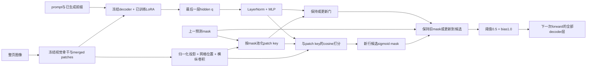

# 行级 patch mask v2：方案与执行协议（2026-09-22）

状态：实现完成，CPU张量测试3项及最终五卡闭环smoke（r5）通过；正式run `glmocr_line_mask_v2_full_20260922_1940` **已于2026-09-23 02:01完成**。选点epoch8/step3456在149页validation上 **micro CER 0.12846305276804149**（对无路由baseline 0.16992365679166466为−0.04146/−24.4%），字面达预注册的CER<=0.14并已用项目自身指标函数独立复现。**保留**：该149页为历史多次使用的development validation，不是locked test；单臂无等预算消融，不可把降幅归因于单一组件；substitution几乎未改善（4048→4024），改善全部来自insertion/deletion（1948→796、1082→531）；同源GT整行参照0.12469仍优于本次0.12846。详见[实验日志](实验日志/GLMOCR/架构收益对照/GLMOCR-line-mask-ddp-v2-20260922.md)。

正式源码快照：`/data3/yky/yangky_ocr_models/glm_ocr_layout_mask_routing/code/line_mask_20260922_v4/ocrmodel`；源码tar SHA256 `838c06d66617a001210731043ac735dc5d240cb6cc46148168c3fb8841ff4c26`。产物根：`/data3/yky/yangky_ocr_models/glm_ocr_layout_mask_routing/training_runs/glmocr_line_mask_v2_full_20260922_1940`。详见[实验日志](实验日志/GLMOCR/架构收益对照/GLMOCR-line-mask-ddp-v2-20260922.md)。

## 依据与边界

近期同一 sparse24 validation149、checkpoint-3000、4M/1536/fast/math-SDPA 下，GT 整行 CER=0.12469390694771211，GT 3–5 字窗口 CER=0.13693762903922793；放回 geometry 小分支后窗口预测逐字节不变。支持选整行为学习目标，但 oracle 的 GT 定位和 synced 指针不可部署。旧 head-only G1/G2/G3 使用不同的未适配基座和 128/64 协议，不能把其数值当作本轮 baseline。

旧模型的高 pooled_peak 不说明定位正确；固定负 bias、未归一化 decoder query、stop 乘 mask、密集背景和反馈误差均值得隔离。现有窗口 trainer 的 mask_and_dice_loss 未传 dice_weight，实际只有 BCE。VAE 旧记录中 kl_active_dims=0；主臂先用确定性预测，VAE 留作后续等预算消融。

参考：Mask2Former 的 [原文](https://arxiv.org/abs/2112.01527) 与 [官方 criterion](https://github.com/facebookresearch/Mask2Former/blob/main/mask2former/modeling/criterion.py) 提供 mask BCE/Dice 的成熟组成；本方案不是复现 Mask2Former，没有对象 query 或预测框。VAE 的 [posterior collapse 研究](https://arxiv.org/abs/1901.05534) 说明潜变量失活需要单独处理，不能假设换 VAE 自动解决定位。

## 输入、模型与时序

- 唯一部署输入：整页图像、prompt。无需 GT 文本、GT/predicted bbox、line id、方向或 synced 指针。
- 固定加载 line100 的 decoder LoRA checkpoint-3000，rank/alpha=8/8，冻结视觉骨干、decoder 和 LoRA，移除小 geometry 分支。
- merged visual features → LayerNorm/Linear(128) + 位置编码 → 横向 1×9 / 纵向 9×1 depthwise conv → 1×1 融合。位置仅由图像 patch 网格产生。
- 最后 decoder layer 的 hidden → LayerNorm + MLP；和上一预测 mask 池化的视觉上下文结合，与 patch key 做 cosine 打分，学习温度（最大30）和 bias（初值−2）。
- 更新门 u=sigmoid(MLP(query, previous visual context))；M=(1−u)M_prev+u sigmoid(score)。初始空状态强制更新；没有 GT mask feedback，没有硬编码阅读方向。Stop auxiliary 独立，不乘 mask、不终止 LM。
- 与已测 line100 一致：prefill 不注入，decode 所有层加 hard(M>=0.5)×1.0。时序是 q 的最后层输出预测 q+1 forward 使用的 mask，即监督 label[q+2]。首 token 由原 LM prefill 产生；不能把本方案描述为控制首 token。
- 冻结骨干意味着本轮没有 OCR CE 反传，也没有借 hard threshold 声称 OCR 可导；成功只能由自由生成 CER 证明。

## 监督和损失

K在每页encode时只归一化一次，候选打分和反馈池化共用。图中的反馈是模型自己的连续概率mask；施加给OCR注意力时才阈值化。没有独立检测器、候选行框、行编号输入或根据GT文字移动的指针。

候选 logits 为 `z[t,n] = exp(s) cos(q[t] + Wc*c[t-1], k[n]) + b`，温度上限30；`u[t]=sigmoid(MLP(q[t],c[t-1]))`；`M[t]=(1-u[t])*M[t-1]+u[t]*sigmoid(z[t])`。首个空状态令u=1。Stop头只接受辅助监督，LM自己的EOS仍是唯一正常终止判据。

完整 chat-template token 对齐沿用 build_mask_targets，line_index 来自训练注释，用当前行字符框凸包 rasterize hard target。缺失空间标注忽略；跨行 token 目前沿用起始字符所属行，作为局限记录。空白无空间目标不当背景，EOS 独立空 mask 项。

L = L_balanced_logits_BCE + L_Dice + 0.2 L_location + 0.2 L_area + 0.2 L_transition + 0.05 L_stop + 0.2 L_empty。

BCE 对正负 patch 分别归一化后按 token 平均；Dice 作用于实际递归 mask；location 是 GT 行内均匀分布对 patch softmax 的交叉熵；area 是 log(predicted mass+1) 和 log(GT line mass+1) 的 smooth-L1，避免零目标 L1 一味压小；transition 根据相邻有效目标行是否改变做分组平衡 BCE。候选 logits 始终有直接监督，降低保持门阻断新行学习的风险。所有 loss、head FP32，梯度 clip=1。

记录 IoU、mass_ratio、每项 loss、grad norm；不能以 peak/total loss 替代定位或 OCR。行级保持是软门，仍可能漂移、漏换行；最后层语义状态和一拍延迟能否足够，由闭环结果判定。

## 五卡 DDP 训练

入口：tools/training/run_line_mask_ddp_a100.sh；实现 train_line_mask_ddp.py、line_mask_head.py、line_mask_runtime.py。

- 物理 GPU0–4，启动时只查询这五张，所有 utilization 严格<50%；torchrun 五进程，DistributedDataParallel 同步单一 head，NCCL_P2P_DISABLE=1/NCCL_IB_DISABLE=1。
- train=完整2159，validation=用户确认的现有149（不是240全官方validation，也不是140）；seed42。官方 split 不等于跨书手/版本严格隔离，不新增此保证。
- batch1/rank、accumulation1、global batch5；DistributedSampler 补齐到2160，每epoch432更新，一页padding重复，8epochs=3456更新，无过滤复杂页。
- LR2e−4，AdamW weight_decay=.01，warmup172更新，完整3456步cosine到0.1；decoder LR0，auxiliary/layout loss0。
- 先并行提取训练页无路由 teacher-forced hidden/视觉特征，缓存源码树外；head 训练由 DDP 完成。第7epoch前用第6epoch的预测 head，在生成 KV 路径中使用 teacher-forced **文字**刷新全部训练页特征；所有施加 mask 均来自预测。第7/8epoch用此缓存，属于固定快照的闭环特征适配，不是完全 on-policy rollout，也没有消除文字 exposure bias。
- 4M像素、fast processor、BF16骨干、math-SDPA；head FP32。KV自由生成1536、greedy。DDP不聚合显存。
- epoch2/4/8各用完整149页自由生成；五rank互斥分片30/30/30/30/29，汇总完整 I/D/S/reference micro CER。baseline同起点不加路由，同149页。按CER最小选一个head；平局保留较早。
- 验收：选中head完整149页 micro CER<=0.14，预测 mask、无reference同步、无删页、无token budget变化，报告EOS/触顶/循环和finite。验证集已被历史多次使用，结果是development validation，不作独立test结论。
- 本请求仅做validation验收，test_manifest_read=false/test_used_for_selection=false；本轮不自动读test。后续如做locked test，须先固定selection，不能据test回调。

## 执行门槛

先独立run执行10train/5validation五卡smoke（最终版2epochs/4更新，第2epoch刷新闭环特征）：检查DDP梯度、缓存、checkpoint reload/finite、生成，smoke不具验收资格。若失败保留产物、登记并用新run ID修复重试。正式训练的任何NaN/Inf/OOM/Traceback或无进展立即报告，不自动重复碰运气；CER不达标如实登记，不把oracle成绩替换为learned成绩。

完整图像SHA256审计确认train/validation内容交集为0；train2159记录包含2158个唯一文件内容（内部一对重复），按全量请求保留并披露；这不是近重复/跨书手隔离保证。闭环smoke揭示Transformers5.3手动KV路径必须传next_sequence_length=1，否则会重复处理整段prefix；最终入口已经显式裁切并检查单token输入。

监控绑定当前任务：最初5分钟，首次RUNNING后最多两次5分钟健康检查，两次确认后同一heartbeat改1小时。完成/失败立即报告并停止旧监控；所有路径、source sha、manifest sha、步骤/结果随实验日志追加。
